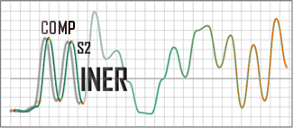

directories/parameters
```{r}
# top level project into subdirectories of which outputs can be written 
projDir <- 'full_path_to_working_directory'
# MS1 level profiling data mzXml/mzML/mgf directory
ms1DataDir <- 'full_path_to_ms1Data_directory'
# MS2 level profiling data mzXml/mzML/mgf directory
ms2DataDir <- 'full_path_to_ms2Data_directory'
# ionization mode
ionMode <- 'pos/neg'
# sample string (optional pre-processing with MetMSLine)
sampStr <- 'sample'
# blank string (optional pre-processing with MetMSLine)
blankStr <- 'blank'
# QC string (optional pre-processing with MetMSLine)
qcStr <- 'QC'
# number of cores for parallel
# use all cores default
nCores <- parallel::detectCores()
```

generate subdirectories in project folder
```{r}
dir.create(paste0(projDir, '/output'))
dir.create(paste0(projDir, '/R'))
dir.create(paste0(projDir, '/R/rDataFiles'))
dir.create(paste0(projDir, '/data'))
dir.create(paste0(projDir, '/doc'))
```

Load packages
```{r, message=FALSE}
# required packages
suppressWarnings(suppressPackageStartupMessages(library(xcms)))
suppressPackageStartupMessages(library(snow))
suppressPackageStartupMessages(library(CAMERA))
suppressPackageStartupMessages(library(compMS2Miner))
suppressPackageStartupMessages(library(MetMSLine))
```

# XCMS (optional)
```{r}
setwd(ms1DataDir)

peakmatrix <- xcmsSet(method="centWave", peakwidth=c(2, 20), ppm=10, snthresh=5,
                      nSlaves=nCores, verbose.columns=TRUE)

ret <- retcor(peakmatrix, method="obiwarp", plottype=c("deviation"))

gret <- group(ret, bw=2, mzwid=0.015, minfrac=0.25)

fill <- fillPeaks.chrom(gret, nSlaves=nCores)
```

# CAMERA (optional)
```{r}
# taken from Beyond Profiling Stanstrup et. al.
# Select which rules to use
rules.jan <- read.csv('full_path_to_CAMERA_rules', 
                      header=TRUE, stringsAsFactors = FALSE)

#Create an xsAnnotate object
xsa <- xsAnnotate(fill, polarity = ifelse(ionMode == 'neg', 'negative', 'positive'))

#Group after RT value of the xcms grouped peak
xsaF <- groupFWHM(xsa, perfwhm=1)

#Verify grouping
#calcCiS just because then we don't the raw data
xsaC <- groupCorr(xsaF,graphMethod='lpc', pval=0.000001, calcCaS = TRUE,
                  cor_exp_th=0.7, cor_eic_th=0.7,calcCiS = FALSE, calcIso = FALSE)

#Annotate isotopes
xsaFI <- findIsotopes(xsaC, ppm=10, mzabs=0.01, intval="into")

#Annotate adducts and neutral losses
xsaFA <- findAdducts(xsaFI, polarity=ifelse(ionMode == 'neg', 'negative', 'positive'), 
                     ppm=10, mzabs=0.01,
                     multiplier=4, rules=rules.jan)
#Generate result
peakTable <- getPeaklist(xsaFA)
# rearrange columns
names(peakTable)[names(peakTable) == 'mz'] <- 'mzmed'
names(peakTable)[names(peakTable) == 'rt'] <- 'rtmed'
peakTable <- cbind(1:nrow(peakTable), peakTable)
colnames(peakTable)[1] <- 'EICno' 
colIndxTmp <- grep("EICno|mzmed|rtmed|adduct", colnames(peakTable))
peakTable <- peakTable[, c(colIndxTmp, setdiff(1:ncol(peakTable), colIndxTmp))]
peakTable[, c(1:3)] <- apply(peakTable[, 1:3], 2, as.numeric)
message('total LC-MS features peakTable: ', nrow(peakTable), '\n')
# save results
setwd(projDir)
write.csv(peakTable, file="full_path_to_peak_table_output_csv", row.names=FALSE)
```

# Pre-processing (optional)
```{r}
# observation names
obsNames <- colnames(peakTable)[grep(sampStr, colnames(peakTable))]
blanks <- colnames(peakTable)[grep(blankStr, colnames(peakTable))]
qcs <- colnames(peakTable)[grep(qcStr, colnames(peakTable))]
# zero fill
peakTable <- MetMSLine::zeroFill(peakTable, c(obsNames, blanks))
# blank fold change greater than 2
peakTable <- MetMSLine::blankSub(peakTable, blankNames=blanks, sampNames=obsNames, 
                                 thresh=2)
# cv calculation using QC samples (retain features >= 30 %)
peakTable <- MetMSLine::cvCalc(peakTable, qcs, thresh=30)
# log transform
peakTable <- MetMSLine::logTrans(peakTable, c(obsNames, blanks))

```

# compMS2Miner
# 1. Pre-processing: compMS2 object construction, noise filtration, composite spectra generation and substructure annotation

## *i.* compMS2 object construction from peak table and MS/MS files.
```{r}
# create compMS2 object
compMS2_object <- compMS2Construct(MS1features=peakTable,
                                   msDataDir=ms2DataDir, nCores=nCores,
                                   mode = ionMode, precursorPpm = 10, 
                                   ret = 20, TICfilter = 10000, verbose=FALSE)
compMS2_object
```

## *ii.* dynamic noise filter
```{r}
compMS2_object <- deconvNoise(compMS2_object, "DNF", verbose=FALSE)
compMS2_object
```

## *iii.* intra-spectrum ion grouping and signal summing

```{r}
compMS2_object <- combineMS2(compMS2_object, "Ions", verbose=FALSE)
compMS2_object
```

## *iv.* inter-spectrum ion grouping and signal summing

```{r}
compMS2_object <- combineMS2(compMS2_object, "Spectra", mzError=0.01,
                             specSimFilter=0.8, verbose=FALSE)
compMS2_object
```

## *v.* remove any potential contaminants/redundant scans (repeating isobaric precursors with near identical spectra)
```{r}
compMS2_object <- combineMS2(compMS2_object, 'removeContam', nContams=6, 
                             maxRtGap=Inf, remContam=TRUE)
compMS2_object
```

## *vi.* annotate possible substructures with internal database (?SubStructure_masses)
```{r}
compMS2_object <- subStructure(compMS2_object, 'Annotate', Frag_mzabs=0.05)
# identify most probable substructure annotation based on total relative intensity
# explained
compMS2_object <- subStructure(compMS2_object, "prob")
# summary of most probable substructure annotation
mostProbSubStr <- subStructure(compMS2_object, "probSummary")
```

# 2. Combinatorial Metabolite Identification

## *i.* match composite spectra to Mass Bank of North America (MoNa) .msp files.
If smiles codes are not detected then they are calculated from InChI (more commonly available in MoNa) using OpenBabel.

```{r}
compMS2_object <- metID(compMS2_object, 'matchSpectralDB', 
                           mspFile='full_path_to_msp_file',
                           minDBDotProdThresh=0.65, verbose=FALSE)
```

## remove possible false positive annotations by spectral database matching
False positives are removed based on summed average word frequency of abstracts
returned from PubMed and cleaned. Erroneous drugs, pesticides and antibiotics
can be identified and removed and/or flagged by this method.
```{r}
compMS2_object <- falsePosIdentify(compMS2_object, removeFP=TRUE,
                                      prohibKeyWords="drug|pesticide|antibiotic|placebo",
                                      meanFreqPerAbs=0.6, verbose=FALSE)

```

## *ii.* internal metabolomic database annotation
taking in to account cluster ions identified by the CAMERA package and included
in the 4th column of the MS1feature table and additional mandatory common electrospray
adducts.

```{r}
# substructure types
# none
subStrMassShift <- c(42.010565, 119.004101, 176.03209, 255.988909,
                     305.068159, 57.021464, 161.014666, 79.956817)
names(subStrMassShift) <- c("acetyl", "cysteine", "glucuronide",
                            "glucuronide sulfate", "glutathione", "glycine",
                            "mercapturate", "sulfate")

#  common mandatory esi adducts i.e. added to those detected in the MS1 data by CAMERA
if(ionMode == 'neg'){
  mandEsiAdducts <- c('[M-H2O-H]-', '[M+Na-2H]-', '[M+Cl]-', '[M+K-2H]-',	'[M-H+HCOOH]-',	
                      '[M-H+CH3COOH+Na]-', '[M-H+CH3COOH]-')
} else {
  mandEsiAdducts <- c('[M+NH4]+', '[M+H3O]+', '[M+Na]+','[M+CH3OH+H]+', 
                      '[M+CH3COONa]+', '[M+K]+', '[M+2Na-H]+')
}
# what if any substructure detected?
subStrMassShift <- subStrMassShift[names(subStrMassShift) %in% names(mostProbSubStr)]
# internal database annotation
compMS2_object <- metID(compMS2_object, "dbAnnotate", SubStrs=subStrMassShift,
                           metDB=HMDB, includeElements=c('C', 'H', 'N', 'O', 'P', 
                                                         'S', 'F', 'Cl', 'Br',
                                                         'I'), 
                           esiAdducts=mandEsiAdducts, MS1adducts=TRUE)
compMS2_object <- metID(compMS2_object, "dbAnnotate", SubStrs=subStrMassShift,
                           metDB=LMSD, includeElements=c('C', 'H', 'N', 'O', 'P', 
                                                         'S', 'F', 'Cl', 'Br', 
                                                         'I'),
                           esiAdducts=mandEsiAdducts, MS1adducts=TRUE)
```

## *iii.* select most probable annotations based on substructures detected and calculate a substructure score

```{r}
compMS2_object <- metID(compMS2_object, "dbProb", minTimesId=1, 
                           verbose=FALSE)
```

## *iv.* Phase II metabolite prediction 

```{r}
# predict any phase II metabolite structures
compMS2_object <- metID(compMS2_object, 'predSMILES')
```

## *v.* Random forest based retention time prediction using calculated molecular descriptors

```{r}
compMS2_object <- metID(compMS2_object, 'rtPred', verbose=FALSE)
```

## *vi.* *in silico* fragmentation prediction (MetFrag and CFM)

```{r}
# in silico
compMS2_object <- metID(compMS2_object, "metFrag", autoPossId=TRUE, 
                           possContam=6, verbose=FALSE)
compMS2_object <- metID(compMS2_object, "CFM", autoPossId=TRUE, 
                           possContam=6, verbose=FALSE)
```

## *vii.* Correlation and spectral similarity graph calculation
optimum correlation and spectral similarity cut-offs are estimated using
the network density plateau miminum.  If no plateau minima is found then the
median value of the downward slope is returned.
```{r}
# correlation network
compMS2_object <- metID(compMS2_object, method='corrNetwork', peakTable,
                           obsNames, corrMethod='pearson', corrThresh=NULL, 
                           MTC='none', MS2only=3, maxNodes=7000, minClustSize=3)

# spectral similarity
compMS2_object <- metID(compMS2_object, method='specSimNetwork', 
                           minDotProdThresh=NULL, minClustSize=3)
```

## *viii.* mean maximum first neighbour (correlation or spectral similarity connected) chemical similarity scoring

```{r}
compMS2_object <- metID(compMS2_object, 'chemSim', autoPossId=TRUE,
                        possContam=6, minEdges=2, minSimScore=0.7, 
                        verbose=FALSE)
```


## *ix* build consensus score
```{r}
compMS2_object <- metID(compMS2_object, 'buildConsensus',
                        include=c('massAccuracy', 'inSilico', 'chemSim',
                                  'rtPred', 'substructure', 'pubMed'), 
                        autoPossId=TRUE, possContam=6, minMeanBCscore=0.1, 
                        verbose=FALSE)
```
## *x* assess false positive and false negative rates.
```{r}
tpSumBC <- trueFalseSum(compMS2_object, verbose=FALSE)
```

## *xi* flag potential false positive assignments
False positives are identified based on summed average word frequency of 
abstracts returned from PubMed and cleaned. Erroneous drugs, pesticides and 
antibiotics can be identified and removed and/or flagged by this method.
```{r}
compMS2_object <- falsePosIdentify(compMS2_object, removeFP=FALSE,
                                   prohibKeyWords="drug|pesticide|antibiotic|placebo",
                                   meanFreqPerAbs=0.6, verbose=FALSE)

```
## *xii* annotate or predict compound class
```{r}
compMS2_object <- annoCompoundClass(compMS2_object, overWrite=TRUE, 
                                    minSimScore=0.8, verbose=FALSE)
```

## *xiii* visualize, manually interpret and add identification comments (optional)
```{r, eval=FALSE}
compMS2_object <- compMS2Explorer(compMS2_object)
```

# 3. Publish apps to a self-contained zip file (which can be uploaded to an online repository e.g. GitHub) or publically on the shinyApps website.

```{r}
appName <- paste0('compMS2_object_', toupper(ionMode))
publishApp(compMS2_object, appName=appName, 
           writeDir=paste0(projDir, 'output/'), 
           addFiles=c(paste0(projDir, 'R/', 'compMS2_workflow.pdf')))
```

## Post "publication" the zip file can be directly opened using compMS2Explorer, modified and potentially re-published
```{r, eval=FALSE}
# full path to zip file written by publishApp function
compMS2_object <- compMS2Explorer(paste0(projDir, 'output/', appName,'/', 
                                         appName, '.zip'))
```

```{r}
sessionInfo()
```